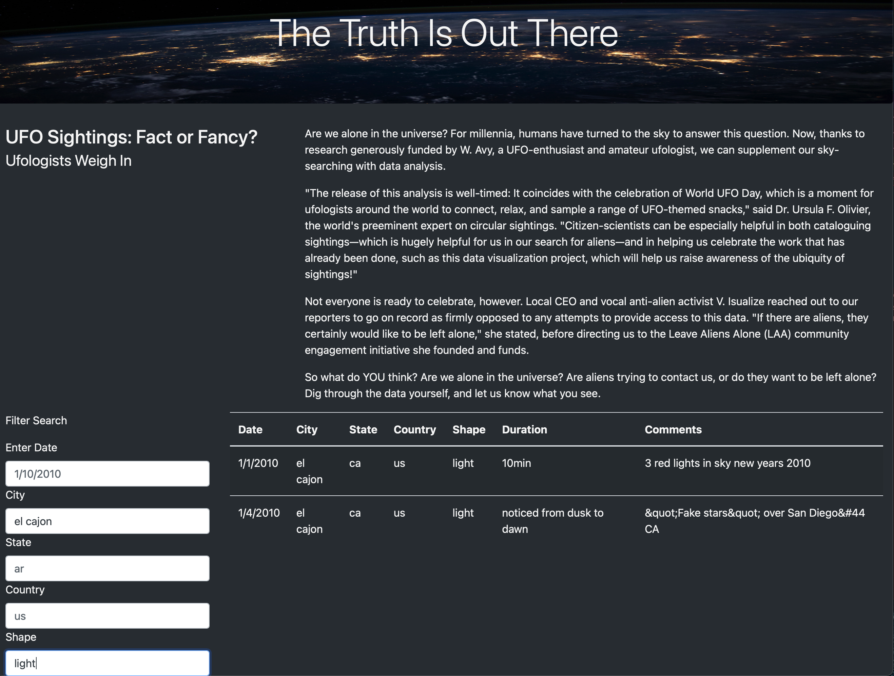

# UFO Sightings Filter
## Overview
The goal of this project was to create a web page that would allow for users to filter UFO sightings based on multiple criteria including Date, City, State, Country, and Shape.
## Results
The additional search filter criteria allows the user to more narrowly define the location and type of UFO sighting they're looking for.  For example, if users wanted to focus on finding sightings only for El Cajon, CA that were in a "light" shape, they could leverage the following filter:

## Summary
While this update is helpful to narrow the search results, it no longer includes a "Filter" button that would be more intuitive for users to click on in order to complete their search.  Additionally, this requires users to know what data points are available within the dataset.  This could be challenging and require a lot of trial and error.  An easier design would leverage a drop-down selection to limite the filter options to only those selections available in the data set.  
Additionally, it would be helpful to allow the users to export data easily to a separate file (e.g. text, or csv).  It's likely they'd want to do further analysis, and that would enable a more seamless data capture. 